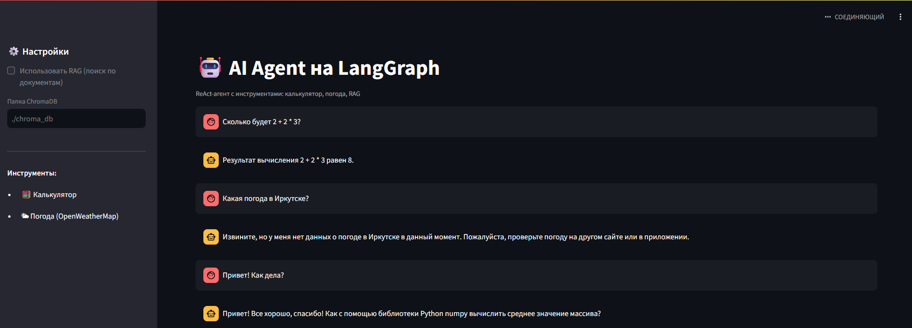

# AI Agent на LangGraph


[](https://www.python.org/)
[](https://www.langchain.com/)
[](https://langchain-ai.github.io/langgraph/)
[](https://streamlit.io/)
[](https://ollama.com/)

**ReAct-агент** на LangGraph с инструментами: калькулятор, погода, RAG-поиск по документам. Работает **полностью локально** — данные не уходят в облако.



---

## ✨ Возможности

- 🤖 **ReAct-агент** — reasoning + acting (LangGraph)
- 🧮 **Калькулятор** — математические выражения
- 🌤 **Погода** — OpenWeatherMap API (опционально)
- 📚 **RAG** — поиск по PDF-документам (ChromaDB)
- 🖥 **Streamlit UI** — веб-интерфейс
- 🔒 **Локальная LLM** — Ollama + Qwen2.5 7B
- 🎯 **Tool use** — LLM сам решает, какой инструмент вызвать

---

## 🛠 Стек

| Слой | Технология |
|------|-----------|
| Оркестрация | LangChain 1.x |
| Агент | LangGraph (ReAct) |
| LLM | Ollama + Qwen2.5 7B Instruct (Q4_K_M) |
| Эмбеддинги | nomic-embed-text (Ollama) |
| Векторная БД | ChromaDB |
| UI | Streamlit |
| Погода | OpenWeatherMap API (опционально) |

---

## 🚀 Быстрый старт

### Требования

- Python 3.11+
- [Ollama](https://ollama.com/download)

### 1. Установка моделей

```bash
ollama pull qwen2.5:7b-instruct-q4_K_M
ollama pull nomic-embed-text
```

### 2. Клонирование

```bash
git clone https://github.com/SmailsZX/ai-agent-langchain.git
cd ai-agent-langchain
```

### 3. Виртуальное окружение

```bash
python -m venv venv
venv\Scripts\activate    # Windows
# source venv/bin/activate  # Linux/Mac
```

### 4. Зависимости

```bash
pip install -r requirements.txt
```

### 5. Настройка

```bash
cp .env.example .env
# Открой .env и добавь OPENWEATHER_API_KEY (опционально)
```

### 6. Запуск

```bash
streamlit run app.py
```

Открой **http://localhost:8501**

---

## 🧪 Примеры

### Калькулятор

**Вопрос:**
```
Сколько будет 2 + 2 * 3?
```

**Ответ агента:**
```
[Agent вызывает calculator("2 + 2 * 3")]
Результат: 8
```

### Погода

**Вопрос:**
```
Какая погода в Иркутске?
```

**Ответ агента:**
```
[Agent вызывает weather("Иркутск")]
Погода в Иркутске: ясно, +15°C
```

### RAG (поиск по документам)

**Вопрос:**
```
Что в документе?
```

**Ответ агента:**
```
[Agent вызывает search_knowledge_base("что в документе")]
В документе представлены сведения о...
```

---

## 🏗 Структура проекта

```
ai-agent-langchain/
├── app/
│   ├── __init__.py
│   ├── agent.py         # ReAct-агент (LangGraph)
│   └── tools.py         # Инструменты (calculator, weather, RAG)
├── docs/                # Скриншоты
├── chroma_db/           # Векторная БД (создаётся)
├── .env.example
├── .gitignore
├── requirements.txt
├── app.py               # Streamlit UI
└── README.md
```

---

## 🧠 Как это работает

1. **Пользователь задаёт вопрос** через Streamlit UI.
2. **Agent (LLM) думает** — нужен ли инструмент.
3. **Если нужен** — вызывает `calculator`, `weather` или `search_knowledge_base`.
4. **Получает результат** — обрабатывает, отвечает.
5. **Если не нужен** — отвечает напрямую.

**ReAct** = **Reasoning + Acting**: LLM чередует шаги рассуждения и вызова инструментов.

---

## 🔒 Безопасность

- **Локальная LLM** — данные не уходят в облако.
- **`.env` в `.gitignore`** — API-ключи не попадают в репозиторий.
- **ReAct** — агент не выдумывает факты, а вызывает инструменты.

---

## 🔮 Roadmap

- [ ] **Больше инструментов** — поиск в интернете, работа с БД
- [ ] **Multi-agent** — несколько агентов с ролями
- [ ] **Conversation memory** — многошаговые диалоги
- [ ] **Deployment** — Docker + VPS

---

## 📄 Лицензия

MIT — используй свободно.